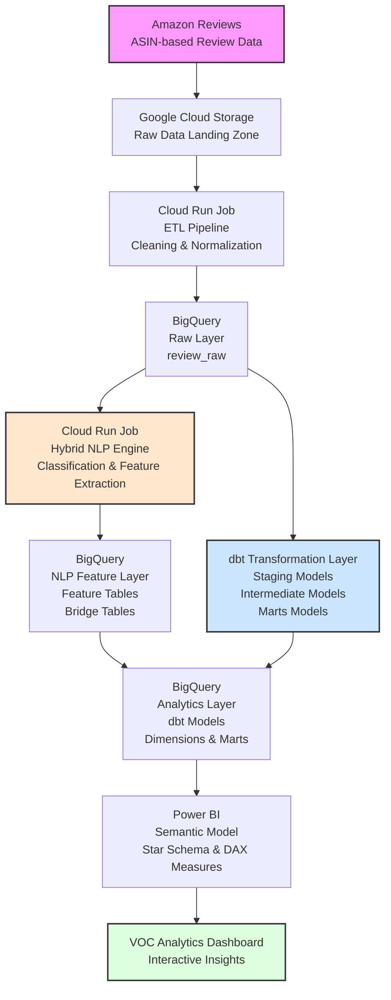

[English](README.md) | [简体中文](README.zh-CN.md)

# Amazon VOC Pipeline

A cloud-based Amazon Voice of Customer (VOC) analytics pipeline that transforms unstructured Amazon reviews into structured, business-oriented insights.

The project integrates data engineering, hybrid NLP, analytics engineering with dbt, BigQuery dimensional modeling, and a Power BI semantic layer into an end-to-end analytical pipeline.

---

## System Architecture



---

## NLP 2.0

NLP 2.0 uses a hybrid classification approach combining deterministic rules with semantic similarity.

The pipeline extracts:

- Scenes
- Frictions
- Motivations
- Time of Day
- Locations
- Keywords

The semantic component uses `SentenceTransformer` with `all-MiniLM-L6-v2`.

Classification results retain decision signals such as `Source`, `Score`, and `Margin`.

The NLP pipeline generates review-level features and multi-label bridge tables consumed by downstream analytical models and BI reporting.

---

## Data Model

### Raw Layer

`voc_raw.review_raw`

Stores normalized Amazon review data produced by the ETL pipeline.

Data is loaded incrementally using `WRITE_APPEND`, while downstream models handle canonical review selection and analytical deduplication.

### NLP Output Layer

`voc_features (Python Generated)`

```text
review_processing
review_features
scene_bridge
friction_bridge
motivation_bridge
time_bridge
location_bridge
```

These tables are generated by the Python-based NLP pipeline and store classification results, keywords, and multi-valued NLP labels.

### dbt Transformation Layer

`voc_features (dbt Managed)`

```text
stg_review
int_canonical_reviews
dim_review
dim_asinreview
```

dbt models are built on top of raw review data and NLP-generated feature tables.

dbt transforms these inputs into clean, documented, and tested analytical models.

### Analytical Model

```text
AsinProduct (1)
      │
      ▼
dim_asinreview (*)
      │
      ▼
dim_review (1)
      │
      ├── scene_bridge (*)
      ├── friction_bridge (*)
      ├── motivation_bridge (*)
      ├── time_bridge (*)
      └── location_bridge (*)
```

The analytical model follows a dimensional modeling approach with a star schema and bridge tables.

Multi-valued NLP attributes are resolved through bridge tables linked to `Review_ID`, enabling clean filtering, grouping, and drill-down in Power BI without creating Cartesian products.

This design avoids ambiguous filter propagation and preserves one-to-many analytical relationships in the semantic model.

---

## Power BI Semantic Model


The semantic layer is implemented in Microsoft Power BI using a semantic model built on top of BigQuery dimensional tables.

BigQuery serves as the analytical data warehouse and provides dimensional tables, while Power BI implements the semantic layer through relationship modeling, DAX measures, and interactive analytical experiences.

The semantic model includes:

- Tabular model design following dimensional modeling principles
- Explicit measure layer using DAX
- Star schema modeling with bridge tables
- Dimension and bridge table relationships
- Calculation logic for review coverage, rating distribution, friction analysis, and motivation analysis
- Context-aware filtering across NLP dimensions
- Review-level drill-down analysis

Key modeling techniques include:

- Bridge tables for multi-valued NLP dimensions
- Review-level relationship preservation
- `TREATAS` and set-based filtering for virtual relationship propagation
- Filter context management across multiple analytical dimensions
- Dynamic measures for scene, friction, and motivation analysis

Example DAX pattern for cross-dimensional analysis:

```dax
Motivation Friction Reviews =
CALCULATE(
    [All Reviews],
    TREATAS(
        INTERSECT(
            VALUES(bMotivation[Review_ID]),
            VALUES(bFriction[Review_ID])
        ),
        dReviews[Review_ID]
    )
)
```

This measure demonstrates cross-dimensional analysis by calculating reviews that simultaneously belong to selected motivation and friction categories while preserving review-level granularity through virtual relationships.

### Analytical Capabilities

The Power BI semantic model enables:

- Cross-dimensional analysis across scenes, frictions, motivations, time, and locations
- Review coverage analysis to measure NLP classification penetration
- Rating distribution and variability analysis
- Customer friction discovery through NLP-driven dimensions
- Review-level drill-through from aggregated insights to individual customer feedback

PBIP stores report and semantic model definitions as text-based files, enabling source control and change tracking through Git.

---

## Repository Structure

```text
amazon-voc-pipeline/
├── amazon-voc-etl/
│   └── Data ingestion and normalization pipeline
│
├── amazon-voc-nlp/
│   └── Hybrid NLP classification pipeline
│
├── amazon-voc-dbt/
│   └── dbt transformation models, tests, and documentation
│
├── sql/
│   └── BigQuery DDL scripts and schema definitions
│
├── PowerBI/
│   └── Power BI PBIP project containing semantic model and report definitions
│
├── docs/
│   └── Architecture and semantic model diagrams
│
├── .gitignore
├── README.md
└── README.zh-CN.md
```

- `amazon-voc-etl` — data ingestion and normalization
- `amazon-voc-nlp` — NLP classification and feature generation
- `amazon-voc-dbt` — dbt transformation models and tests
- `sql` — BigQuery DDL scripts and schema definitions
- `PowerBI` — Power BI PBIP project containing semantic model and report definitions
- `docs` — project documentation and architecture diagrams

---

## Technology Stack

### Data Engineering

Python · pandas · openpyxl · PyArrow

### Analytics Engineering

dbt · SQL · Data Modeling

### NLP

spaCy · Sentence Transformers · `all-MiniLM-L6-v2` · Regex · Rule-based classification

### Cloud

Google Cloud Storage · BigQuery · Cloud Run Jobs · Docker

### Business Intelligence

Microsoft Power BI · Tabular Semantic Model · DAX · Power Query · TMDL · PBIP Version Control

---

## Processing Strategy

The NLP pipeline is model-version aware and generates feature tables.

Current model version:

`nlp_v2.0_canonical_v1`

Reviews successfully processed under the current model version are skipped.

Failed reviews remain eligible for reprocessing.

To reprocess reviews after fixing rules or data issues, update `MODEL_VERSION` to a new value. This preserves processing history while allowing a clean reprocessing pass.

dbt then transforms the NLP feature tables and raw data into the final analytical models used by Power BI.

---

## Project Status

### Implemented

- Amazon review ingestion
- Cloud-based ETL
- BigQuery raw layer
- dbt-based analytical transformation layer
- dbt-based data quality testing
- BigQuery dimensional modeling
- Hybrid NLP 2.0
- Multi-label bridge tables
- Product-review dimensional model
- Power BI semantic model with DAX-based analytical calculation layer
- Interactive Power BI VOC dashboard
- PBIP-based report and semantic model version control
- Git-based version control

### Planned

- NLP evaluation framework
- Taxonomy refinement
- Pipeline monitoring
- Further performance optimization
- Dashboard enhancement and analytical expansion
- Expanded dbt data quality tests and lineage documentation

---

## Project Goal

Build a reusable VOC analytics framework that transforms large volumes of unstructured customer reviews into structured, tested, and business-oriented insights.