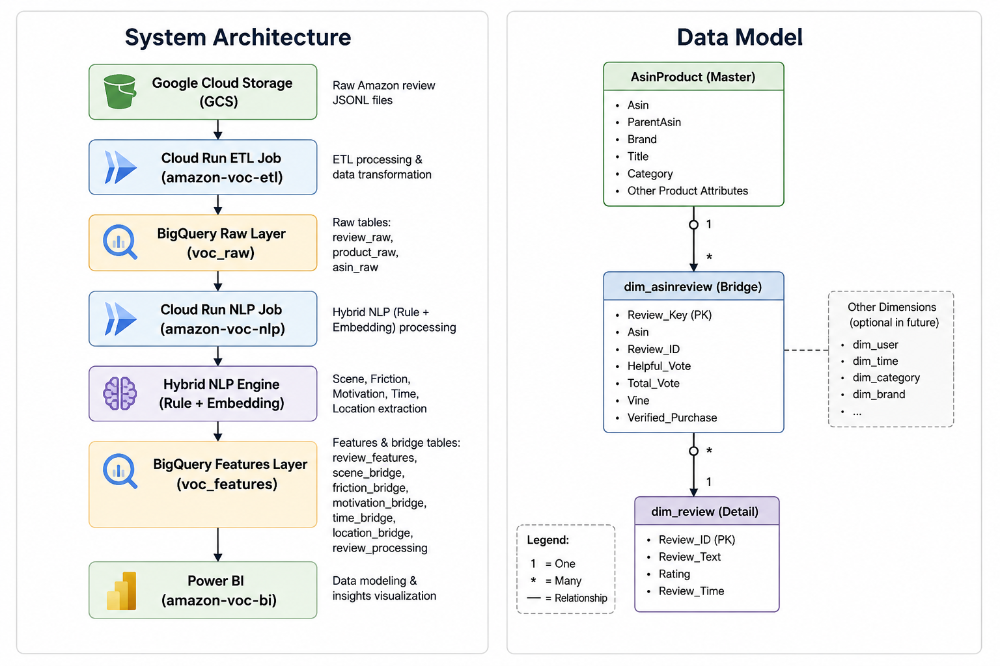

# Amazon VOC Pipeline

A cloud-based Amazon Voice of Customer (VOC) analytics pipeline that transforms unstructured Amazon reviews into structured, business-oriented insights.

The project integrates data engineering, hybrid NLP, BigQuery dimensional modeling, and Power BI into an end-to-end analytical pipeline.

---

## Architecture



---

## NLP 2.0

NLP 2.0 uses a hybrid classification approach combining deterministic rules with semantic similarity.

The pipeline extracts:

- Scenes
- Frictions
- Motivations
- Time of Day
- Locations
- Keywords

The semantic component uses `SentenceTransformer` with `all-MiniLM-L6-v2`.

Classification results retain decision signals such as `Source`, `Score`, and `Margin`.

---

## Data Model

### Raw Layer

`voc_raw.review_raw`

Stores normalized Amazon review data produced by the ETL pipeline.

### NLP Layer

```text
voc_features
├── review_processing
├── review_features
├── scene_bridge
├── friction_bridge
├── motivation_bridge
├── time_bridge
└── location_bridge
```

Independent bridge tables are used for multi-valued NLP dimensions to preserve relationships and avoid Cartesian-product problems.

### Analytical Model

```text
AsinProduct (1)
      │
      ▼
dim_asinreview (*)
      │
      ▼
dim_review (1)
```

---

## Repository Structure

```text
amazon-voc-pipeline/
├── amazon-voc-etl/
├── amazon-voc-nlp/
├── docs/
├── .gitignore
└── README.md
```

- `amazon-voc-etl` — data ingestion and normalization
- `amazon-voc-nlp` — NLP classification and feature generation
- `docs` — project documentation and architecture diagrams

---

## Technology Stack

### Data Engineering

Python · pandas · openpyxl · PyArrow

### NLP

spaCy · Sentence Transformers · `all-MiniLM-L6-v2` · Regex · Rule-based classification

### Cloud

Google Cloud Storage · BigQuery · Cloud Run Jobs · Docker

### Business Intelligence

Microsoft Power BI

---

## Processing Strategy

The NLP pipeline is model-version aware.

Current model version:

`nlp_v2.0_rule_v1`

Reviews already successfully processed by the current model version are skipped. Changing the model version allows the pipeline to reprocess reviews while preserving processing history.

---

## Project Status

### Implemented

- Amazon review ingestion
- Cloud-based ETL
- BigQuery raw and feature layers
- Hybrid NLP 2.0
- Multi-label bridge tables
- Product-review dimensional model
- Power BI analytical model
- Git-based version control

### Planned

- NLP evaluation framework
- Taxonomy refinement
- Pipeline monitoring
- Further performance optimization
- Power BI dashboard expansion

---

## Project Goal

Build a reusable VOC analytics framework that transforms large volumes of unstructured customer reviews into structured, business-oriented insights.