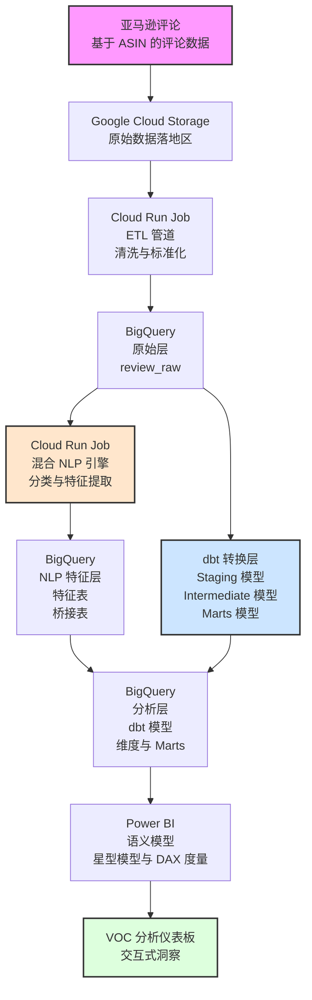

[English](README.md) | [简体中文](README.zh-CN.md)

# Amazon VOC Pipeline

基于云端的亚马逊客户之声（VOC）分析管道，将非结构化的亚马逊评论转化为结构化、面向业务的分析洞察。

项目整合了数据工程、混合 NLP、基于 dbt 的分析工程、BigQuery 维度建模以及 Power BI 语义层，构建端到端的分析管道。

---

## 系统架构



---

## NLP 2.0

NLP 2.0 采用混合分类方法，结合确定性规则与语义相似度。

管道提取以下内容：

- 场景（Scenes）
- 摩擦（Frictions）
- 动机（Motivations）
- 时间（Time of Day）
- 地点（Locations）
- 关键词（Keywords）

语义组件使用 `SentenceTransformer` 和 `all-MiniLM-L6-v2`。

分类结果保留决策信号，如 `Source`、`Score` 和 `Margin`。

NLP 管道生成评论级特征和多标签桥接表，供下游分析模型和 BI 报表使用。

---

## 数据模型

### 原始层

`voc_raw.review_raw`

存储由 ETL 管道生成的标准化亚马逊评论数据。

数据通过 `WRITE_APPEND` 增量加载，下游模型负责 canonical 评论选择和分析去重。

### NLP 输出层

`voc_features (Python 生成)`

```text
review_processing
review_features
scene_bridge
friction_bridge
motivation_bridge
time_bridge
location_bridge
```

这些表由 Python NLP 管道生成，存储分类结果、关键词和多值 NLP 标签。

### dbt 转换层

`voc_features (dbt 管理)`

```text
stg_review
int_canonical_reviews
dim_review
dim_asinreview
```

dbt 模型构建在原始评论数据和 NLP 生成的特征表之上。

dbt 将这些输入转换为干净、有文档、有测试的分析模型。

### 分析模型

```text
AsinProduct (1)
      │
      ▼
dim_asinreview (*)
      │
      ▼
dim_review (1)
      │
      ├── scene_bridge (*)
      ├── friction_bridge (*)
      ├── motivation_bridge (*)
      ├── time_bridge (*)
      └── location_bridge (*)
```

分析模型采用带桥接表的维度建模方法，结合星型模型与桥接表。

多值 NLP 属性通过关联到 `Review_ID` 的桥接表解析，从而在 Power BI 中实现干净的筛选、分组和下钻，而不会产生笛卡尔积。

该设计避免了语义模型中模糊的筛选传播，并保持了一对多的分析关系。

---

## Power BI 语义模型


语义层在 Microsoft Power BI 中实现，使用基于 BigQuery 维度表的语义模型。

BigQuery 作为分析数据仓库并提供维度表，而 Power BI 通过关系建模、DAX 度量和交互式分析体验来实现语义层。

语义模型包括：

- 遵循维度建模原则的 Tabular 模型设计
- 使用 DAX 的显式度量层
- 带桥接表的星型模型建模
- 维度表和桥接表关系
- 评论覆盖率、评分分布、摩擦分析和动机分析的计算逻辑
- 跨 NLP 维度的上下文感知筛选
- 评论级下钻分析

关键建模技术包括：

- 用于多值 NLP 维度的桥接表
- 评论级关系保留
- 使用 `TREATAS` 和基于集合的筛选进行虚拟关系传播
- 跨多个分析维度的筛选上下文管理
- 针对场景、摩擦、动机分析的动态度量

跨维度分析的 DAX 示例模式：

```dax
Motivation Friction Reviews =
CALCULATE(
    [All Reviews],
    TREATAS(
        INTERSECT(
            VALUES(bMotivation[Review_ID]),
            VALUES(bFriction[Review_ID])
        ),
        dReviews[Review_ID]
    )
)
```

该度量值通过虚拟关系计算同时属于所选动机和摩擦类别的评论，并在保持评论级粒度的前提下实现跨维度分析。

### 分析能力

Power BI 语义模型支持：

- 跨场景、摩擦、动机、时间和地点维度的交叉分析
- 评论覆盖率分析，用于衡量 NLP 分类覆盖情况
- 评分分布和变异性分析
- 通过 NLP 驱动维度发现客户摩擦点
- 从聚合洞察下钻到单条客户反馈的评论级下钻

PBIP 以基于文本的文件存储报表和语义模型定义，支持通过 Git 进行源代码控制和变更追踪。

---

## 仓库结构

```text
amazon-voc-pipeline/
├── amazon-voc-etl/
│   └── 数据摄取与标准化管道
│
├── amazon-voc-nlp/
│   └── 混合 NLP 分类管道
│
├── amazon-voc-dbt/
│   └── dbt 转换模型、测试和文档
│
├── sql/
│   └── BigQuery DDL 脚本和模式定义
│
├── PowerBI/
│   └── 包含语义模型和报表定义的 Power BI PBIP 项目
│
├── docs/
│   └── 架构图和语义模型图
│
├── .gitignore
├── README.md
└── README.zh-CN.md
```

- `amazon-voc-etl` — 数据摄取与标准化
- `amazon-voc-nlp` — NLP 分类与特征生成
- `amazon-voc-dbt` — dbt 转换模型和测试
- `sql` — BigQuery DDL 脚本和模式定义
- `PowerBI` — 包含语义模型和报表定义的 Power BI PBIP 项目
- `docs` — 项目文档和架构图

---

## 技术栈

### 数据工程

Python · pandas · openpyxl · PyArrow

### 分析工程

dbt · SQL · 数据建模

### NLP

spaCy · Sentence Transformers · `all-MiniLM-L6-v2` · 正则表达式 · 基于规则的分类

### 云端

Google Cloud Storage · BigQuery · Cloud Run Jobs · Docker

### 商业智能

Microsoft Power BI · Tabular 语义模型 · DAX · Power Query · TMDL · PBIP 版本控制

---

## 处理策略

NLP 管道具备模型版本感知能力，并生成特征表。

当前模型版本：

`nlp_v2.0_canonical_v2`

在当前模型版本下已成功处理的评论会被跳过。

失败的评论仍可重新处理。

若在修复规则或数据问题后需要重新处理评论，请将 `MODEL_VERSION` 更新为新值。这样既能保留处理历史，又能进行干净的重新处理。

随后，dbt 将 NLP 特征表和原始数据转换为 Power BI 使用的最终分析模型。

---

## 项目状态

### 已实现

- 亚马逊评论摄取
- 云端 ETL
- BigQuery 原始层
- 基于 dbt 的分析转换层
- 基于 dbt 的数据质量测试
- BigQuery 维度建模
- 混合 NLP 2.0
- 多标签桥接表
- 产品-评论维度模型
- 基于 DAX 分析计算层的 Power BI 语义模型
- 交互式 Power BI VOC 仪表板
- 基于 PBIP 的报表和语义模型版本控制
- 基于 Git 的版本控制

### 计划中

- NLP 评估框架
- 分类体系优化
- 管道监控
- 进一步性能优化
- 仪表板增强和分析扩展
- 扩展 dbt 数据质量测试和血缘文档

---

## 项目目标

构建一个可复用的 VOC 分析框架，将大量非结构化客户评论转化为结构化、经过测试且面向业务的洞察。